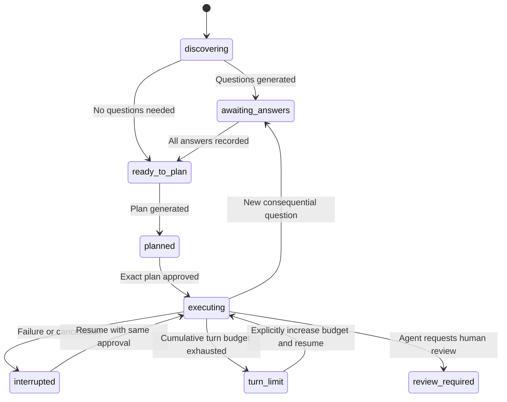

# Bootstrap context

## builtin/coding.md

# Coding standards

Follow the project's language conventions, formatter, and established error
handling. Prefer small, explicit modules and validated boundary inputs. Avoid new
dependencies without a recorded reason. Ask which compatibility targets and
coding standards apply when project documentation does not establish them.


## builtin/architecture.md

# Architecture guidance

Keep domain logic independent of CLI, transport, and persistence details. Reuse
established application boundaries. Document decisions, alternatives, and
consequences. Ask before selecting storage, changing public contracts, or
introducing a service when the request and project policies leave that uncertain.


## builtin/deployment.md

# Deployment guidelines

Identify environments, release ownership, secrets management, migration and
rollback requirements. Ask for missing deployment decisions before designing
release changes. Never deploy or expose credentials through the agent tools.


## builtin/git.md

# Commit and Git strategy

Preserve unrelated user changes. Keep commits focused and describe behavior and
validation. Ask which branch, commit format, and review strategy applies when
unknown. The baseline harness records changes but does not execute Git commands.


## builtin/testing.md

# Verification guidance

Map acceptance criteria to observable evidence. Use project-approved tests and
checks. Report what was verified and what remains unverified. The baseline has
no command runner: provide suggested commands for the user, and never report
tests as passed without execution evidence.


## README.md

# Solar Forge

A Python CLI for request-driven coding agents. The workflow and audit trail are
independent of the model: use OpenAI, Claude, Ollama, or an OpenAI-compatible
server. Model identifiers are always supplied by you.

Write a request, answer application-specific questions, review a plan, and approve
file edits. Every run leaves its request, documentation, decisions, model calls,
and change evidence inside the project.

## Install

Python 3.11 or newer:

```sh
python -m venv .venv
source .venv/bin/activate
python -m pip install -e .
forge --help
```

There are no runtime dependencies. Packaging uses setuptools. To run directly
from this checkout without installing:

```sh
PYTHONPATH=src python -m solar_forge --help
```

## Start a request

Run inside the project you want the agent to work on:

```sh
forge init
```

This creates `request.md`, `.forge/config.toml`, and editable guidance in
`.forge/standards/`. Existing files are preserved. Customize the guidance for your
application and replace the request template:

```markdown
# Request: Export billing invoices

## Description
Allow finance staff to export invoices as CSV.

## Technical Details
Use the existing billing service and authorization rules.
Record any unresolved business rules as questions before coding.

## Acceptance Criteria
- [ ] Export includes invoice number, customer, currency, and total.
- [ ] Unauthorized users cannot export invoices.
- [ ] Date filters have documented timezone behavior and boundary tests.
```

For multiple requests, use `forge request "Export billing invoices" --output
requests/billing.md`. Add domain documents and application standards to the
`harness.docs` list in `.forge/config.toml`. The baseline loads those explicit
paths and supplies a bounded file inventory; it does not index the entire repo.
Missing documentation is reported in the context snapshot.

## Choose a provider

Edit the `[provider]` section in `.forge/config.toml`. `model` must be a model
identifier supported by your chosen service; no model is automatically selected.

| Provider kind | API | Default base URL | Default credential environment variable |
| --- | --- | --- | --- |
| `openai` | Responses | `https://api.openai.com/v1` | `OPENAI_API_KEY` |
| `anthropic` | Messages | `https://api.anthropic.com/v1` | `ANTHROPIC_API_KEY` |
| `ollama` | Chat | `http://localhost:11434` | None |
| `compatible` | Chat Completions | `http://localhost:8080/v1` | `LOCAL_MODEL_API_KEY` |

Example for an already installed local model:

```toml
[provider]
kind = "ollama"
model = "your-installed-model"
base_url = "http://localhost:11434"
timeout = 120
```

For a hosted provider, change `kind` and `model`, then export the corresponding
API key. Set `api_key_env` if you use another environment variable. The harness
reads keys from the environment. HTTP is limited to loopback endpoints; remote
endpoints require HTTPS. Redirects are rejected. Authentication is optional for
loopback-compatible servers. Provider/model flags are also available on model
commands, e.g. `forge prepare --provider openai --model YOUR_MODEL`. Changing
provider by flag resets the endpoint and credential variable to provider defaults.

OpenAI uses its API rather than a ChatGPT subscription or browser login. Adapter
contracts follow the official [OpenAI Responses reference](https://developers.openai.com/api/reference/python/resources/responses/methods/create),
[Claude Messages reference](https://platform.claude.com/docs/en/api/messages/create),
and [Ollama chat reference](https://docs.ollama.com/api/chat).

## Workflow

```sh
forge prepare request.md
forge status
```

`prepare` creates an audited run and asks generated domain questions in an
interactive terminal. Each question includes its rationale and documentation
sources. Answers are saved immediately. In scripts, use `--no-interactive` and
answer later. Use the run directory printed by the CLI in the following commands;
replace `RUN` with that project-relative path:

```sh
forge answer RUN
# Or answer one question without an interactive prompt:
forge answer RUN --question Q1 --text "Invoice date filters use UTC."
forge plan RUN
forge run RUN
```

`plan` blocks until every question has an answer. `run` displays the saved plan
and asks for approval before allowing edits. `forge run RUN --approve` explicitly
approves that exact saved plan without a terminal prompt. Approval is tied to its
SHA-256 digest. Editing the plan invalidates approval. Changes to the request or
context documents require a new run.

The agent can list files, read text files, write text files, ask new questions,
and finish with a review summary. It must read an existing file before replacing
it. Every write records original content, proposed content, and a diff. New
questions pause execution, invalidate approval, and require answers plus a
revised plan. An interactive `run` asks those questions immediately; then use
`plan` and `run` again to review and approve the revised approach.

Interrupted execution can be resumed with `forge run RUN`. Failed initial
discovery can be retried with `forge discover RUN`; locate its directory using
`forge status`. Provider failures and rejected actions remain in the event log.
Ctrl-C preserves answers and checkpoints. A forced process kill can leave a
`.lock` file: verify the process has exited, remove only that run's lock, and
resume. Turn counts are cumulative; after `turn_limit`, deliberately increase
`harness.max_turns` in configuration or begin a smaller request.

Use `forge --project /path/to/project COMMAND` when working outside the project.

## Audit layout

```text
agentic_audit/
  export-billing-invoices/
    <UTC-timestamp>-<unique-id>/
      request.md             # Original request
      context.json           # Documentation, skipped paths, bounded inventory
      context.md             # Readable documentation snapshot
      questions.md           # Questions, provenance, and recorded answers
      plan.md                # Current implementation plan
      state.json             # Answers, approval digest, conversation, checkpoint
      events.jsonl           # Chronological workflow and tool events
      calls/                 # Inputs and outputs of every model call
      changes/<turn>/        # Before/after text, diff, hashes, and original path
      summary.md             # Human review and suggested verification
```

Repeated requests share a title folder and get distinct run directories. Keep
audit artifacts under your project's version-control and retention policy.
`state.json` is authoritative; Markdown artifacts are readable views. Events and
saved calls retain earlier plans even when `plan.md` is replaced.

## Boundaries of this baseline

This is a single-agent workflow, ready to extend behind provider and tool
interfaces. It edits project files but does not execute shell commands, tests,
Git operations, or deployments. A finished run has state `review_required` and
marks acceptance criteria as unverified. Run suggested checks yourself before
accepting changes.

Traversal, symlinks, known credential paths, and writes to request/context,
policy, Git, and audit files are blocked. File size, initial documentation size,
serialized prompt size, HTTP response size, and agent turns are bounded. These
are application checks for a trusted local user, not an OS sandbox or protection
against a process concurrently replacing paths. Each run has its own lock;
multiple runs in the same project are not coordinated.

Explicit documentation, request text, file names, and agent-read contents are
sent to the selected provider and stored in the audit trail. Credentials in
arbitrarily named files cannot be detected reliably: curate documentation and
review your audit retention policy. API keys are not written by the adapter.

Streaming, cost accounting, retrieval, OS-isolated verification, Git/deployment
actions, and optional multi-agent coordination are follow-up work. See the
[implementation plan](docs/implementation-plan.md) and
[architecture](docs/architecture.md).

## Development

```sh
PYTHONPATH=src python -m unittest discover -s tests -v
```

Tests use scripted responses, mocked adapter payloads, and a temporary loopback
HTTP server to exercise the complete CLI. No paid model calls or real credentials
are needed. The HTTP integration test requires permission to open a local socket.


## docs/architecture.md

# Architecture

Solar Forge uses Python 3.11+ and the standard library at runtime. Provider SDKs,
terminal frameworks, and persistence services are unnecessary for the baseline.
The UI, workflow rules, transport, and file operations have separate modules.

## Modules

| Module | Responsibility |
| --- | --- |
| `cli.py` | Parse commands, display artifacts, prompt for answers and approval |
| `domain.py` | Validate request headings and TOML configuration |
| `context.py` | Load explicit documentation and bundled guidance with provenance |
| `providers.py` | Normalize HTTP transports behind `Provider.complete` |
| `workflow.py` | Discovery, questions, answers, planning, context consistency |
| `agent.py` | Approved execution, action validation, write journal and recovery |
| `workspace.py` | Project path boundaries, size checks, inventory, atomic writes |
| `audit.py` | Run directories, checkpoints, events, artifacts, per-run locks |

## State transitions



Approval is a persisted plan hash, not another state. No file-edit tool is
available during discovery or planning. The request and documentation are
snapshotted; policy changes require fresh discovery. Application source files
may change during execution, so reads record content hashes and replacement
writes require a matching read. No automatic Git reset or rollback occurs.

## Common provider contract

`Provider.complete(system, messages) -> str` accepts portable text turns. The
harness asks for JSON and validates its schema itself, allowing local models that
lack provider-specific tool or structured-output APIs. Native tool calling can
be added inside adapters without changing the domain workflow.

Transport errors, invalid JSON, empty output, truncated responses, and invalid
actions have distinct evidence. A malformed execution response becomes feedback
for the next bounded turn. Discovery/planning validation failures leave state
unchanged so the user can retry. Automatic network retries are deliberately
absent, avoiding silent duplicate paid requests.

## Questions and policy

Bundled guidance supplies defaults; project guidance and explicit user answers
are authoritative. Every generated question must cite a supplied documentation
path or `request.md`. A source citation proves the path exists in the snapshot;
it does not prove the model interpreted it correctly. Human review remains part
of the workflow. The baseline treats all questions as blocking; optional or
conditional questions are future work.

## Write and failure recovery

Before a write, the harness checks approval, unchanged request/policy, path
boundaries, size, and the last read hash. It saves before/after snapshots and a
write-intent event before atomically replacing the file. A pending action is
checkpointed before tool execution. On resume, an interrupted write compares the
current file to the journal hashes: matching the intended output means the write
already occurred; matching the original means it may be applied; any third
version is rejected. New writes use restrictive temporary-file permissions;
replacement writes preserve the existing file's ordinary permission bits.

Events, questions, and state are separate filesystem writes, not a transaction
or cryptographically chained log. State is the recovery authority; event records
may repeat around interrupted actions. The audit is reviewable project evidence,
not a tamper-proof compliance ledger. Exact byte snapshots preserve UTF-8 CRLF.

## Next extension points

1. Add OS-isolated read/write and command runners with explicit capabilities,
   timeout/output budgets, and tests proving workspace/network isolation.
2. Build an acceptance verifier that attaches actual command and artifact
   evidence before transitioning from review to completion.
3. Add streaming adapters, cancellation, usage reporting, and context retrieval.
4. Add Git and deployment tools with separate reviewable approval records.
5. Introduce project-level locking and optional coordinated agents only after
   defining ownership of shared files, decisions, and audit artifacts.


## docs/implementation-plan.md

# Solar Forge implementation plan

## Objective

Build a Python CLI that turns a structured `request.md` into a documented,
interactive, provider-independent coding workflow. Project policy and recorded
human answers must govern architectural, deployment, and Git decisions.

## Architecture

- **CLI:** thin argparse entry point; readable prompts and resumable commands.
- **Domain:** validated requests, questions, workflow states, and configuration.
- **Context:** explicit project documentation plus bundled guidance, with a
  bounded inventory. File contents are data, not permission to execute actions.
- **Providers:** one text-completion protocol; OpenAI Responses, Anthropic
  Messages, Ollama chat, and OpenAI-compatible chat endpoints behind adapters.
  Model names are configuration, never embedded in orchestration.
- **Workflow:** discover → ask → plan → approve → execute → review. New domain
  uncertainties return control to the user before further changes.
- **Tools:** bounded project listing/reading/writing. No arbitrary shell, Git,
  or deployment execution in the baseline.
- **Audit:** `agentic_audit/<request-title-slug>/<run-id>/` contains immutable
  request/context snapshots, Markdown questions/answers/plan/summary, state,
  provider responses, tool evidence, and chronological JSONL events.

## Delivery increments

1. Commit this plan before implementation.
2. Build packaging, request template/parser, configuration, policy templates,
   context collection, and audit persistence. Test parsing and path boundaries.
3. Add provider adapters and the resumable question/plan workflow. Validate
   adapter payloads with mocked HTTP; do not require credentials for tests.
4. Add a bounded agent loop with explicit plan approval, project tools,
   interruption recovery, mid-run questions, change backups/diffs, and review
   output. Test the full workflow with a scripted offline provider.
5. Document installation, configuration, commands, limitations, and next steps;
   smoke-test the installed CLI and commit each coherent tested increment.

## Baseline acceptance criteria

- `forge init` creates a request template, project configuration, and editable
  coding, architecture, deployment, Git, and testing guidance without overwriting.
- `forge prepare` validates requests, snapshots context, and creates questions
  grounded in named documentation. No project edits happen during discovery.
- `forge answer` prompts in the terminal and records each answer immediately.
- `forge plan` blocks on unanswered questions; `forge run` presents that plan
  and records approval before permitting edits.
- All supported providers share the same orchestration and tool protocol.
- Each run has a collision-resistant directory and a recoverable state.
- Tools reject traversal, symlinks, credentials, policy/audit edits, and oversized
  files. Every attempted tool action and failed model call leaves evidence.
- The loop has a turn limit and returns a review artifact rather than claiming
  that unverified acceptance criteria have passed.
- Tests run offline with the Python standard library.

## Follow-up work

Streaming UI; native provider tool calls behind the common protocol; token and
cost accounting; context retrieval; OS-isolated command/test runners; explicit
Git/deployment approvals; stronger audit integrity; concurrent-run coordination;
optional agent delegation; acceptance-criterion verification. The baseline is a
local trusted-user tool, not an OS sandbox or tamper-proof compliance system.

## Delivery status

All five baseline delivery increments are implemented. Automated verification
covers request/path validation, provider contracts, question gates, plan
approval, audited edits, pause/resume, write recovery, prompt budgets, and a full
CLI workflow through a temporary local HTTP server. Package build and installation
have been checked. Live model quality and cloud connectivity remain unverified.
The bootstrap development record is in `agentic_audit/build-solar-forge-baseline/`.
