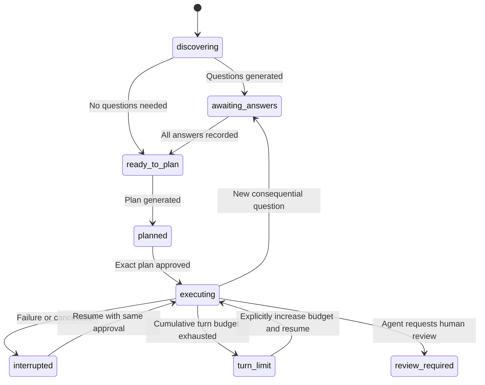

# Architecture

Solar Forge uses Python 3.11+. The provider, workflow, and persistence layers
use the standard library; full-screen chat uses prompt_toolkit for portable
keyboard input and terminal rendering.
The UI, workflow rules, transport, and file operations have separate modules.

## Modules

| Module | Responsibility |
| --- | --- |
| `cli.py` | Parse commands, display artifacts, prompt for answers and approval |
| `domain.py` | Validate request headings and TOML configuration |
| `progress.py` | Event-derived activity snapshots, observer delivery, elapsed work and usage summaries |
| `personality.py` | Load the shared packaged voice for chat and structured model prompts |
| `standards.py` | Bounded language detection and composition of packaged coding-standard templates |
| `context.py` | Load explicit documentation and bundled guidance with provenance |
| `retrieval.py` | Local passage index, ranked search, freshness checks, citations and retrieval evidence |
| `providers.py` | Normalize HTTP transports behind `Provider.complete` |
| `workflow.py` | Discovery, questions, answers, planning, context consistency |
| `agent.py` | Approved execution, action validation, write journal and recovery |
| `verification.py` | Named trusted command execution, process limits, evidence and recovery |
| `workspace.py` | Project path boundaries, size checks, inventory, atomic writes |
| `audit.py` | Run directories, checkpoints, events, artifacts, per-run locks |
| `chat.py` | Conversation and explicit workflow actions, pending-turn retry, transcripts, session history |
| `chat_workflow.py` | Chat command routing, request drafting, run selection, review and approval |
| `terminal_chat.py` | Full-screen terminal presentation, keyboard actions, background replies |

## Terminal chat

`forge chat` uses the same Provider interface without the agent JSON-action
prompt. It refreshes project guidance, the current request, and selected coding
run details for each conversational call.
TerminalChat presents history, conversation, status, and a multiline composer
using prompt_toolkit. No HTTP chat transport or browser assets are shipped.
The CLI imports this presentation only when launching chat, keeping the other
commands independent of terminal rendering. Model text is displayed literally
with terminal-control sequences removed.

Synchronous provider calls and workflow actions run in a worker thread through asyncio.to_thread.
The UI handles keyboard events while waiting and prevents overlapping actions.
Exit requests during a call wait until its response or failure is persisted.
The same ChatService backs terminal chat and previously saved browser sessions.

A session's `run_kind` is `chat` and its status is `chatting`, independent of the
coding workflow state machine. Before a call, a pending user message is saved;
after a successful reply, the message/reply pair is committed and the pending
marker cleared. Retry preserves that same user turn. An audit lock serializes
each session. Provider calls are not exactly-once: a process kill after a model
reply but before its checkpoint can cause a repeated call on retry. Conversational
model replies have no file-edit or command tools. User-entered slash commands
route to the same prepare/answer/plan/run modules used by the CLI. Saved sessions belong to their original provider and
model; sending with another configuration requires a new session.

The chat state persists `workflow_run`, request drafts, an optional question being
answered, and the hash of the plan displayed for review. `/request` gathers fields
without changing project files; `/save-request` explicitly writes the validated
draft, checking that an existing request has not changed since drafting began.
During drafting or answer entry, plain text fills the prompt; `/ask` sends a
conversation turn without recording it as a workflow answer.

`/plan` and `/run` display a plan and record its exact hash. `/approve` checks that
hash, the selected run's model, and unchanged request/documentation under the run
lock before approving and executing. Provider text cannot invoke this path.
Commands and results are saved in the chat transcript; coding calls and changes
remain in the selected coding run's audit. Preparation links its new run to the
chat before discovery, so provider failures can be retried with `/discover`.
New questions, interrupted execution, and run reopening retain the existing
workflow state machine and approval rules. `/changes` displays saved diffs.

Conversation and request limits remain enforced by ChatService and the provider
adapters. See the [terminal chat implementation plan](../agentic_audit/requests/terminal-chat/implementation-plan.md).
The earlier [browser plan](../agentic_audit/requests/chat/implementation-plan.md) is retained as design history.

## State transitions

Approval is a persisted plan hash, not another state. No file-edit tool is
available during discovery or planning. The request and documentation are
snapshotted; policy changes require fresh discovery. Application source files
may change during execution, so reads record content hashes and replacement
writes require a matching read. No automatic Git reset or rollback occurs.

## Common provider contract

`Provider.complete(system, messages) -> str` accepts portable text turns. The
harness asks for JSON and validates its schema itself, allowing local models that
lack provider-specific tool or structured-output APIs. Native tool calling can
be added inside adapters without changing the domain workflow.

Transport errors, invalid JSON, empty output, truncated responses, and invalid
actions have distinct evidence. A malformed execution response becomes feedback
for the next bounded turn. Discovery/planning validation failures leave state
unchanged so the user can retry. Automatic network retries are deliberately
absent, avoiding silent duplicate paid requests.

## Questions and policy

Bundled guidance supplies defaults; project guidance and explicit user answers
are authoritative. Every generated question must cite a supplied documentation
path or `request.md`. A source citation proves the path exists in the snapshot;
it does not prove the model interpreted it correctly. Human review remains part
of the workflow. The baseline treats all questions as blocking; optional or
conditional questions are future work.

## Write and failure recovery

Before a write, the harness checks approval, unchanged request/policy, path
boundaries, size, and the last read hash. It saves before/after snapshots and a
write-intent event before atomically replacing the file. A pending action is
checkpointed before tool execution. On resume, an interrupted write compares the
current file to the journal hashes: matching the intended output means the write
already occurred; matching the original means it may be applied; any third
version is rejected. New writes use restrictive temporary-file permissions;
replacement writes preserve the existing file's ordinary permission bits.

Events, questions, and state are separate filesystem writes, not a transaction
or cryptographically chained log. State is the recovery authority; event records
may repeat around interrupted actions. The audit is reviewable project evidence,
not a tamper-proof compliance ledger. Exact byte snapshots preserve UTF-8 CRLF.

## Local retrieval

Core guidance remains in `harness.docs`. Optional `rag.sources` define a separate
library; empty sources fall back to the existing document list. The standard-library
retrieval module chunks supported text files into bounded passages with path, line
range, and source hash. A versioned JSON index is written atomically; a checksum
catches accidental corruption. This is not a tamper-proof or encrypted store.
Search checks a fresh source manifest before BM25-style lexical ranking. Indexing
and queries make no provider calls. File count, source bytes, index size, query
length, result count, and serialized passage-result bytes are bounded.

The CLI exposes index, status, and search without constructing a provider. Chat
has equivalent commands and automatically retrieves for the current message.
Preparation retrieves for the request and includes results in its context snapshot.
Coding agents can use the named `search_docs` action. Retrieval results are saved
under audit `retrieval/` with query, citations, hashes, and freshness information;
retrieved paths are accepted as question sources only after they were supplied.
Prompt instructions treat passages as reference data, never authorization.

Prepared runs bind retrieval policy and source fingerprints. Source/configuration
changes invalidate preparation even after rebuilding the index. Disabled RAG does
not affect legacy runs. File tools protect library sources and index storage.
Always-on guidance retains its independent change checks and prompt budgets.
Source files are re-read for freshness, so this bounded first version favors
correctness over large-corpus performance. There are no embeddings, remote data
connectors, or semantic query expansion.

## Verification execution

Preparation snapshots the validated verification policy into run state. Planning
appends the exact command configuration to the reviewable plan, whose hash is
approved before execution. Policy changes invalidate the run. Legacy runs without
a policy can continue only with verification disabled.

The agent's `run_check` action accepts only a configured name. The POSIX runner
uses fixed argv with no shell, a minimal environment, project cwd, closed stdin,
bounded output capture, and process-group termination on timeout or cancellation.
The model receives the result as tool feedback and can repair code and rerun.
Checks execute trusted project code with local user permissions; this is not
filesystem/network isolation. Detached descendants and a hard harness crash can
outlive normal process-group cleanup. Command side effects are not journaled.

An intent is persisted before spawn and a result before advancing the agent's
checkpoint. Resuming a completed check reuses its result. An intent with no result
is reported as interrupted with unknown outcome and is never automatically
replayed. Checks clear cached file reads because they may modify the workspace.
Summaries distinguish actual outcomes from model notes and flag results predating
later agent writes; external edits and check side effects are not tracked by this
flag. Acceptance criteria still need human review.

## Next extension points

1. Add OS-isolated read/write and command runners with explicit capabilities,
   timeout/output budgets, and tests proving workspace/network isolation.
2. Build an acceptance verifier that attaches actual command and artifact
   evidence before transitioning from review to completion.
3. Add streaming adapters, cancellation, richer usage/cost reporting, and semantic retrieval.
4. Add Git and deployment tools with separate reviewable approval records.
5. Introduce project-level locking and optional coordinated agents only after
   defining ownership of shared files, decisions, and audit artifacts.

## Language standards at initialization

New-project initialization selects supported languages using explicit repeatable
CLI flags, the interactive fourth setup step, or bounded filename detection in
noninteractive mode. The selection is persisted as `harness.languages` (an empty
list means generic). Legacy configurations default to the empty list.

`standards.py` composes generic coding guidance with only the selected packaged
Python, TypeScript, and JavaScript sections. Init writes that composition to the
existing `.forge/standards/coding.md` context path; unselected templates are not
injected into model prompts. Guidance files are created exclusively, preserving
existing bytes on repeat setup. Missing coding guidance is restored from the saved
selection. Conflicting language flags on existing configuration fail before writes.
All interactive choices are gathered before setup creates files.

## Shared model voice

`guidance/personality.md` is loaded by `personality.py` and prefixed to the chat
and structured-workflow system prompts. Provider adapters continue to receive the
same system/messages contract. Existing prompt-call audit records capture the
exact personality text used for each call. The task-specific instructions follow
the personality and retain JSON-only output, approval, and evidence requirements.
Personality is conversational guidance; it does not execute actions or replace
project coding standards. Scripted tests verify integration, not live-model tone.

## Live progress and provider usage

Audit events reduce into a bounded `progress.json` sidecar independently of run
state. Observer delivery uses a context-local callback scoped to the UI's worker
invocation; the terminal schedules updates on its event loop. A quarter-second
refresh updates active elapsed time without repeatedly loading audit histories.
Callbacks and progress persistence are best-effort and cannot authorize actions
or overwrite workflow checkpoints. The UI strips control sequences and bounds
panel line widths; no source contents or raw provider payloads enter the snapshot.

ProviderText preserves the provider's string response interface and attaches
per-response normalized usage. Ollama's terminal stream frame can carry usage
without visible text. Usage is persisted with the call outcome even when response
validation rejects the text. There is no mutable last-response counter on the
provider, avoiding stale usage across calls. Custom adapters returning plain strings
remain compatible and show unavailable counts. Claude input normalization includes
its cache read/write token fields; other adapters use their aggregate input counts.

Active duration accumulates provider-call and tool intervals. Waiting on people is
excluded. A resumed unfinished interval ends at its last recorded timestamp rather
than counting the gap as active work. Existing runs lacking snapshots start new
metrics with an explicit historical-coverage warning. Snapshots do not reconstruct
old token usage, imply that an abandoned process is alive, or replace saved diffs.
