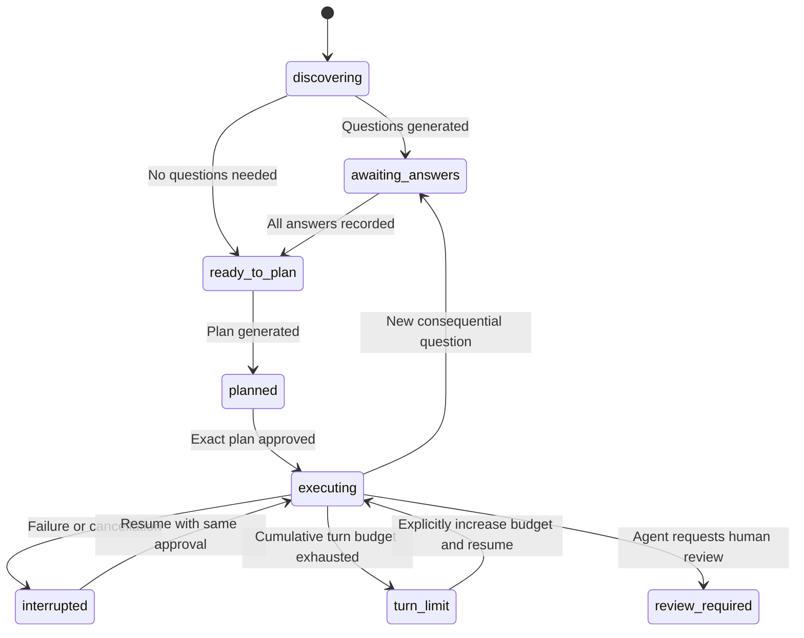

# Architecture

Solar Forge uses Python 3.11+ and the standard library at runtime. Provider SDKs,
terminal frameworks, and persistence services are unnecessary for the baseline.
The UI, workflow rules, transport, and file operations have separate modules.

## Modules

| Module | Responsibility |
| --- | --- |
| `cli.py` | Parse commands, display artifacts, prompt for answers and approval |
| `domain.py` | Validate request headings and TOML configuration |
| `context.py` | Load explicit documentation and bundled guidance with provenance |
| `providers.py` | Normalize HTTP transports behind `Provider.complete` |
| `workflow.py` | Discovery, questions, answers, planning, context consistency |
| `agent.py` | Approved execution, action validation, write journal and recovery |
| `workspace.py` | Project path boundaries, size checks, inventory, atomic writes |
| `audit.py` | Run directories, checkpoints, events, artifacts, per-run locks |
| `chat.py` | Plain conversation, pending-turn retry, transcripts, session history |
| `chat_server.py` | Authenticated loopback HTTP transport and browser launcher |
| `web/` | Packaged chat UI; no external scripts, fonts, or dependencies |

## Browser chat

`forge chat` uses the same Provider interface without the agent JSON-action
prompt. It snapshots project guidance and the current request once per session.
The server binds only to 127.0.0.1; an ephemeral URL-fragment token authenticates
API requests. Host and Origin checks reject other web origins, and credentials
remain server-side. The frontend renders conversation text through textContent
under a restrictive content security policy.

A session's `run_kind` is `chat` and its status is `chatting`, independent of the
coding workflow state machine. Before a call, a pending user message is saved;
after a successful reply, the message/reply pair is committed and the pending
marker cleared. Retry preserves that same user turn. An audit lock serializes
each session. Provider calls are not exactly-once: a process kill after a model
reply but before its checkpoint can cause a repeated call on retry. Chat has no
file-edit or command tools. Saved sessions belong to their original provider and
model; sending with another configuration requires a new session.

HTTP requests and responses use bounded bodies, and the UI waits for complete
replies. The server remains in the launching terminal and finishes active reply
threads when stopped. See the [chat implementation plan](chat-implementation-plan.md).

## State transitions

Approval is a persisted plan hash, not another state. No file-edit tool is
available during discovery or planning. The request and documentation are
snapshotted; policy changes require fresh discovery. Application source files
may change during execution, so reads record content hashes and replacement
writes require a matching read. No automatic Git reset or rollback occurs.

## Common provider contract

`Provider.complete(system, messages) -> str` accepts portable text turns. The
harness asks for JSON and validates its schema itself, allowing local models that
lack provider-specific tool or structured-output APIs. Native tool calling can
be added inside adapters without changing the domain workflow.

Transport errors, invalid JSON, empty output, truncated responses, and invalid
actions have distinct evidence. A malformed execution response becomes feedback
for the next bounded turn. Discovery/planning validation failures leave state
unchanged so the user can retry. Automatic network retries are deliberately
absent, avoiding silent duplicate paid requests.

## Questions and policy

Bundled guidance supplies defaults; project guidance and explicit user answers
are authoritative. Every generated question must cite a supplied documentation
path or `request.md`. A source citation proves the path exists in the snapshot;
it does not prove the model interpreted it correctly. Human review remains part
of the workflow. The baseline treats all questions as blocking; optional or
conditional questions are future work.

## Write and failure recovery

Before a write, the harness checks approval, unchanged request/policy, path
boundaries, size, and the last read hash. It saves before/after snapshots and a
write-intent event before atomically replacing the file. A pending action is
checkpointed before tool execution. On resume, an interrupted write compares the
current file to the journal hashes: matching the intended output means the write
already occurred; matching the original means it may be applied; any third
version is rejected. New writes use restrictive temporary-file permissions;
replacement writes preserve the existing file's ordinary permission bits.

Events, questions, and state are separate filesystem writes, not a transaction
or cryptographically chained log. State is the recovery authority; event records
may repeat around interrupted actions. The audit is reviewable project evidence,
not a tamper-proof compliance ledger. Exact byte snapshots preserve UTF-8 CRLF.

## Next extension points

1. Add OS-isolated read/write and command runners with explicit capabilities,
   timeout/output budgets, and tests proving workspace/network isolation.
2. Build an acceptance verifier that attaches actual command and artifact
   evidence before transitioning from review to completion.
3. Add streaming adapters, cancellation, usage reporting, and context retrieval.
4. Add Git and deployment tools with separate reviewable approval records.
5. Introduce project-level locking and optional coordinated agents only after
   defining ownership of shared files, decisions, and audit artifacts.
